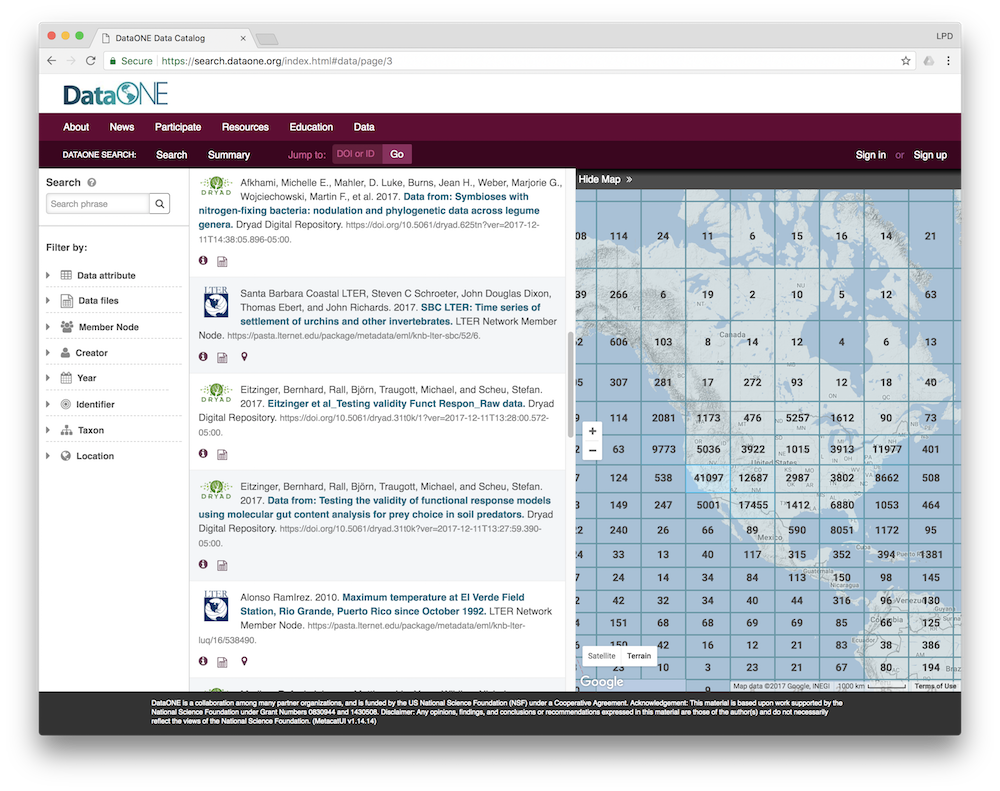

# Upgrading the Search UI



## Updating the Search UI
The production Search UI, `search.dataone.org`, is hosted on two machines, and all need to be upgraded individually:

- `search-ucsb-1.dataone.org`
- `search-orc-1.dataone.org`

For the DataONE test environments, all Search UIs are hosted on a single machine:
- `search.test.dataone.org`

This machine is configured to host the following virtual hosts:
- `search-dev.test.dataone.org`
- `search-dev-2.test.dataone.org`
- `search-sandbox.test.dataone.org`
- `search-sandbox-2.test.dataone.org`
- `search-stage.test.dataone.org`
- `search-stage-2.test.dataone.org`

When upgrading the SearchUI software for each environment, it will be installed in the appropriate `DocumentRoot` configured for the virtual host.

## Upgrade steps

1. Download the latest version of MetacatUI from https://github.com/NCEAS/metacatui/releases

    ```bash
     wget https://github.com/NCEAS/metacatui/archive/metacatui-2.12.0.zip
     ```

2. Unpack the `.zip` or `.tar.gz` file

     ```bash
     unzip metacatui-2.12.0.zip
     ```

3. Backup the currently-installed Search UI files

     ```bash
     cp -rf /var/www/search.dataone.org .
     ```

4. Open the ` metacatui-2.12.0/src/index.html` file in a text editor and change the `appConfigPath` variable towards the beginning of the HTML file to match the location where the DataONE MetacatUI theme config file will be deployed.

#### Production

For production, this will be in the `themes` directory included in MetacatUI:

     ```html
     ...
     <script type="text/javascript">
       // The path to your configuration file for MetacatUI. This can be any web-accessible location.
       var appConfigPath = "/js/themes/dataone/config.js";
     </script>
     ...
     ```

#### Development

Config files for development environments are not released in the MetacatUI repository, but instead are maintained in a separate `metacatui-config` repository here: https://github.nceas.ucsb.edu/walker/metacatui-config

Each CN development environment will have a config file in that repository. Download the corresponding config file and deploy to the `DocumentRoot` configured for the virtual host. Set the `appConfigPath` to that root path:

     ```html
     ...
     <script type="text/javascript">
       // The path to your configuration file for MetacatUI. This can be any web-accessible location.
       var appConfigPath = "/config.js";
     </script>
     ...
     ```

See the MetacatUI documentation for more detailed instructions and for customization options: https://nceas.github.io/metacatui/

5. Move the new search UI files to the root directory where web files are served.

     ```bash
     cp -rf metacatui-2.12.0/src/* /var/www/search.dataone.org/
     ```

## Installing a new Search UI
1. Set up a VM and configure Apache to serve web files from a directory in `/var/www/`. Follow steps 1-5 above to install MetacatUI in the `/var/www/` directory.

2. Add the FallbackResource Apache directive and allow encoded slashes:

    ```apache
    ...
    # Serve index.html instead of a 404 error in the MetacatUI directory
    <Directory "/var/www/search.dataone.org">
      FallbackResource /index.html
    </Directory>

    # Allow encoded slashes in URLs so encoded identifiers can be sent in MetacatUI URLs
    AllowEncodedSlashes On
    ...
    ```

See the MetacatUI Apache configuration documentation for further details: https://nceas.github.io/metacatui/install/apache.html

3. If having issues with CORS requests to the CN, configure Apache to proxy requests to DataONE CN API calls. Add the following Apache directives:

     ```apache
     SSLProxyEngine on
     ProxyPass "/cn/v2/" "https://cn.dataone.org/cn/v2/"
     ProxyPassReverse "/cn/v2/" "https://cn.dataone.org/cn/v2/"
     ```

     Enable these Apache mods:
     ```bash
     a2enmod proxy_http
     a2enmod proxy
     ```
